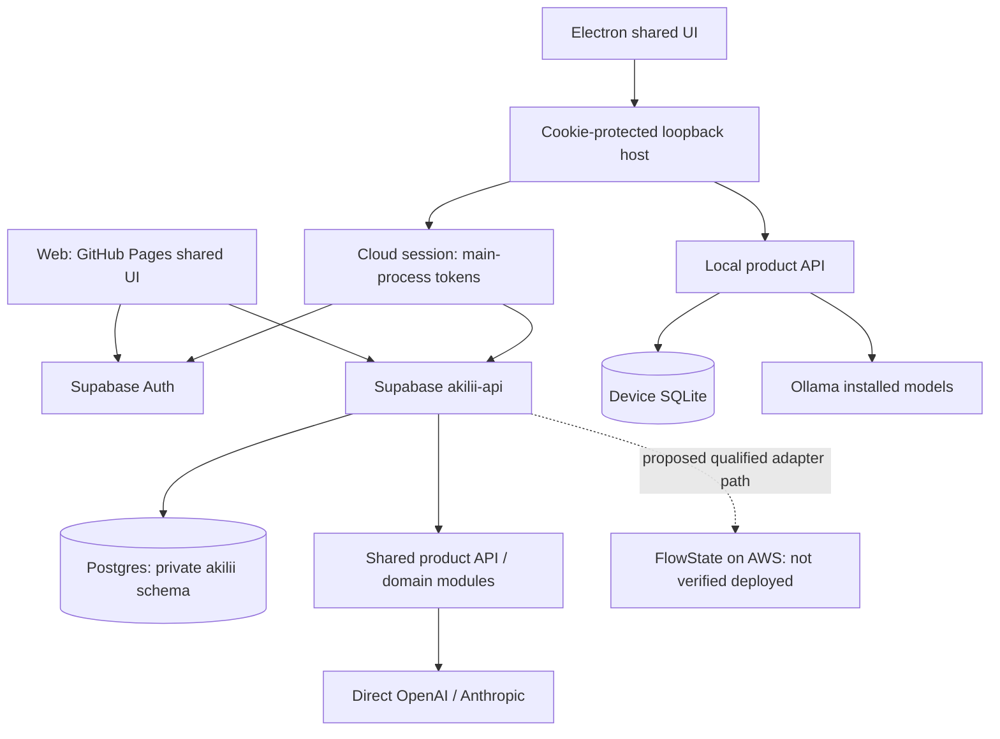

# Current full-stack handover

6 September 2026. Source baseline `cbdc7009837a91e14431231f8dc7ffd8ebae7cb3`; desktop release `v0.1.0-alpha.8`. This is a current-state audit and proposed handover baseline, not George's acceptance. The root README is the reading entry point.

## Actual architecture



Solid arrows describe implemented paths, not universal live acceptance. The legacy Sites/D1 deployment is outside this diagram and has separate users/data. Microsoft browser Graph and Realtime WebRTC have separate provider paths; neither establishes FlowState orchestration.

## Code map and state ownership

| Concern | Current source | Ownership / limit |
|---|---|---|
| Shared renderer | `src/app.template.html`, `app.css`, `app.js`, feature scripts; `build.mjs` | UI state and rendering. Generated `app.html` is not authored. |
| Web authentication | `src/auth-entry.js`, `src/desktop-handoff.js`, static build | Supabase identity; no email-based merging across identity systems. |
| Cloud facade | `supabase/functions/akilii-api/index.ts` | Verified identity/session, admission, Postgres transaction context and extended API routes. |
| Shared domain API | `src/server.js`, `backend/*` | Conversations, Work, approved memories, bounded chat. It is not the complete PRD domain model. |
| Cloud schema | `supabase/migrations/*`, `backend/postgres-adapter.js` | Private user-owned product data. Do not apply SQLite migrations here. |
| Projects/media/connectors | `backend/workspace.js`, `media.js`, `email.js`; `src/microsoft-ui.js` | Some capabilities exist only in the cloud facade or browser connector. |
| Model selection/tools | `backend/models.js`, `anthropic.js`, `work-agent.js` | Allowlisted providers; explicit Work opt-in, read-only bounded lookup. |
| Runtime investigation | `backend/flowstate.js`, `backend/runtime.js`, `backend/mcp.js` | Adapter and internal transports; not a qualified full SupportRuntime. |
| Native host | `desktop/main.cjs`, `shared-host.cjs`, `cloud-session.cjs` | Random loopback cookie, main-process auth, native lifecycle/menu, selected mode. |
| Local data/provider | `desktop/workspace-settings.cjs`, `local-provider.cjs`, `migrations/*` | SQLite at userData/shared-workspace; Ollama on loopback. No app-level database encryption. |
| Historical local data | userData/local-v01 JSON | Retained separately; no automatic migration or cloud sync. |
| UI tests | `tests/*.test.mjs`, `desktop/*.test.cjs`, browser scripts | Browser scripts currently depend on author-machine Chrome/Playwright paths; portability is an open handover task. |

## Capability matrix

“Implemented” means source exists. Only a dated live acceptance record can close a gate.

| Capability | Web/cloud | Desktop cloud | Desktop local |
|---|---|---|---|
| Shared UI/theme/mobile shell | Implemented | Bundled shared source | Bundled shared source |
| Google/email identity | Implemented; SMTP test delivered | PKCE/email transport implemented; packaged acceptance needed | Account-free device owner |
| Microsoft sign-in | Configuration pending | Configuration and packaged acceptance pending | Not needed |
| Conversations, basic context, Work | Implemented | Proxied to same cloud API | Implemented subset; separate store |
| Projects/tasks | Cloud CRUD exists | Same cloud API; verify native journey | Missing local project CRUD |
| Claude/OpenAI | Server adapters/allowlist | Same server adapters | Installed Ollama models instead |
| Bounded Work lookup | Opt-in direct-provider loop | Same cloud API | Local read-only lookup |
| Outlook/calendar/To Do | Browser connector; owner smoke recorded historically | External connector callback parity incomplete | Not a local connector implementation |
| Gmail drafts | Code exists; live acceptance pending | External connector parity incomplete | Not implemented |
| Voice/images | Cloud provider interfaces; acceptance limitations | Device permissions/playback acceptance needed | No equivalent fully local voice/image pipeline |
| FlowState agent workflow | Not qualified | Not qualified | Not qualified; health does not equal execution |
| Full NPR / learning lifecycle | Incomplete | Incomplete | Incomplete |
| Admission/traction | 30 reserved cloud seats + waiting list; private aggregate report | Same cloud gate | Local use not counted or limited by cloud cohort |

## Reproduce and diagnose

Follow root README commands. A fresh developer must verify them independently; existing local build success is not a clean-machine handover. Install/start Ollama and a consciously selected model for local inference. Model acquisition is not bundled. Cloud mode requires the configured Supabase service and an admitted verified user. Do not weaken auth to make a local test pass.

Start with synthetic data: sign in/setup, create a conversation, receive a response, save Work, restart/resume, stop a response, then export/delete. Repeat independently in local mode. Test unavailable providers, revoked access, expired auth, rejected permissions and a second user. Record OS, app/backend revision, model, migration state and result. Never put tokens or personal transcripts into issue logs.

Current prior verification: 35 root tests, 16 desktop tests; responsive fixture at 320/390/430 and 1280. These do not prove screen-reader acceptance, mobile keyboard behaviour, real multi-user isolation of every route, Windows execution or FlowState cancellation. The latest Pages and validation workflows for the source baseline were confirmed successful during this audit.

## Deployment/configuration inventory

| Service | Known reference | Handover requirement |
|---|---|---|
| GitHub | FullSpektrum-ai/akilii; main; GitHub Pages | Give George repository/Actions/release access and branch protection policy. |
| Supabase | `xmesqilkgeaoqrxbooqe`; Edge Function `akilii-api` | Give project role; record region, deployed backend revision, migration ledger, backup/restore and auth configuration. Backend SHA is not inferred from Pages SHA. |
| Google | `crypto-pulsar-398216` | Verify sign-in clients, exact callbacks, test-user/verification status and separate Gmail scope approval. |
| Microsoft | Advanced Thinking Ltd; client `ed108868-454a-43be-aa52-d668251dfbbb` | Existing Graph SPA and Supabase auth callback are separate. Server auth credential, claims and supported-account review remain pending; an approval is not a completed configuration. |
| Resend | advancedthinking.co; signin@advancedthinking.co | DNS verified and one OTP delivered historically; complete real code flow, inspect delivery limits, rotation and sender ownership. |
| Model providers | OpenAI and Anthropic | Transfer project access and billing ownership; check model availability/limits without exposing keys. |
| AWS | Proposed hosted FlowState | No tracked IaC, endpoint, region/resource manifest or deployment receipt establishes a service in this checkout. Verify account inventory before making an absence claim about the entire account. |

Server configuration referenced in the Supabase entry point: `SUPABASE_URL`, `SUPABASE_DB_URL`, `SUPABASE_ANON_KEY`, `OPENAI_API_KEY`, `ANTHROPIC_API_KEY`, `EMAIL_TOKEN_KEY`. OAuth and SMTP secrets are dashboard configuration, not application source. Secret values are deliberately absent. Record owner, location, rotation date and expiry through the approved credential manager.

Pages workflow runs build and root tests before publication. The separate validation workflow also runs desktop tests; Pages does not wait on that workflow's success. Neither workflow packages/signs native applications or deploys the backend. Backend deployment currently uses:

```sh
supabase functions deploy akilii-api --use-api --project-ref xmesqilkgeaoqrxbooqe
```

Before any deployment, compare local/remote migration ledgers and rehearse compatible changes on isolated data. Do not reset the live database. Define an immutable release manifest tying frontend, backend, schema and desktop artifacts together. Current rollback/restore is not rehearsed: record a known-good frontend/backend artifact and test database restore in isolation before closing G09.

## AWS and FlowState: proposed target, not operating instructions

The earlier note reports Free-plan credits inspected on 5 September; this audit has not revalidated account eligibility, balances or prices. Do not assume permanent zero-cost hosting or upgrade a billing plan silently.

Proposed smallest slice: one pinned FlowState container behind an authenticated TLS gateway, external model API, dedicated agent configuration, Supabase retaining canonical user/product state. No personal configuration mounts, unrestricted shell, public laptop service or default GPU/vector cluster. The local `runtime/` directory is untracked; a clean clone cannot reproduce those local files. Do not copy them blindly into a release.

Required before deployment: agreed region/data processing; capacity measurement; infrastructure definition; machine authentication and identity binding; tool allowlist; secret injection; patch/health/log policy; storage and backup plan; explicit cancel acknowledgement; two-user isolation; scoped permissions and receipts; load/cost limits. Budget compute, storage, IPv4, egress, snapshots, logs and external model calls separately. Alerts are not hard spend caps. Record shutdown/credit-expiry policy and a reviewed paid fallback.

A healthy FlowState endpoint is insufficient. G06 requires one real useful workflow, idempotent approved persistence, partial failure recovery, cancellation of actual work, and traceable results. Direct-provider lookup does not satisfy that test.

## George's takeover acceptance

- André grants repository, Figma and service access, chooses the single pilot scenario and approves scope changes against the original web-only plan.
- George independently runs a clean checkout and explains cloud/local routing, migrations and auth recovery without this chat.
- Jointly reconcile PRD/ADR/Figma conflicts; create signed decision records with evidence rather than marking proposed indexes accepted.
- George produces a platform capability/route test matrix, one real runtime qualification, one learning-loop proof and deployment/restore rehearsal.
- Joint go/no-go requires explicit known limitations, owners, support contact/coverage, costs and rollback. Until then this remains an alpha review handover.
