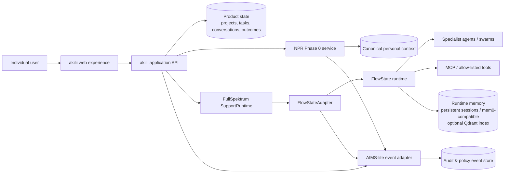

# akilii Definitive MVP — Lean Engineering PRD

> **Engineering contract:** definitive about the MVP outcome, product boundaries, state ownership, interfaces, controls, and proof; provisional where implementation evidence is not yet sufficient.

## 0. Document control

| Field | Value |
|---|---|
| Product | akilii |
| Stage | Definitive MVP / Phase 0 |
| Product class | Personal Support Intelligence |
| Document version | 0.1 (implementation baseline) |
| Status | Draft for product, engineering, design, safety, and privacy sign-off |
| Date | 2026-08-26 |
| Product owner | FullSpektrum Product — named individual TBD |
| Technical owner | FullSpektrum Engineering — named individual TBD |
| Design owner | FullSpektrum Design — named individual TBD |
| Safety/privacy owner | FullSpektrum Safety & Privacy — named individual TBD |
| Canonical product surface | akilii authenticated web application |
| Selected orchestration runtime | FlowState, accessed only through a FullSpektrum-owned adapter |
| Canonical personal context | NPR Phase 0 store |
| Design source | Current akilii Figma; exact file, page and node references TBD |
| Code source | Canonical akilii product repository TBD; FlowState remains a versioned runtime dependency |
| Review cadence | At each build gate and whenever a LOCKED decision is proposed for change |

### Decision language

| Status | Meaning |
|---|---|
| **LOCKED** | Required for this MVP. Change requires an ADR and product + engineering approval. |
| **PREFERRED** | Default implementation choice. Engineering may change it with recorded rationale and no contract break. |
| **TBD** | Open decision. Must be resolved by the stated build gate. |

### Document set

This file is the compact product and engineering contract. Detailed implementation material belongs in linked specifications, not in an expanded master PRD.

| Linked specification | Purpose | Required by |
|---|---|---|
| [System architecture and state](akilii_mvp_handover/02_SYSTEM_ARCHITECTURE_AND_STATE.md) | Deployment, sequence, failure-mode and trust-boundary diagrams | Gate 1 |
| [NPR Phase 0 data and lifecycle](akilii_mvp_handover/03_NPR_PHASE0_DATA_AND_LIFECYCLE.md) | NPR entity schema, lifecycle rules, retention and migrations | Gate 1 |
| [Support runtime, API and event contracts](akilii_mvp_handover/04_SUPPORT_RUNTIME_API_EVENT_CONTRACTS.md) | FullSpektrum runtime interface, FlowState mapping and versioned events | Gate 1/2 |
| [UX and Figma implementation spec](akilii_mvp_handover/05_UX_FIGMA_HANDOFF_SPEC.md) | Screen states, component/tokens, accessibility annotations and node traceability | Gate 1/2 |
| [Test, evaluation and release pack](akilii_mvp_handover/09_TEST_EVALUATION_RELEASE_PACK.md) | Product metrics, test cohorts, rubrics and release evidence | Gate 3/4 |
| [Safety, privacy and accessibility pack](akilii_mvp_handover/10_SAFETY_PRIVACY_ACCESSIBILITY.md) | Threat model, data handling, safety policy and accessibility controls | Gate 2/4 |
| [Convergence, traceability and ADR pack](akilii_mvp_handover/11_CONVERGENCE_TRACEABILITY_ADR.md) | Asset inventory, critical traceability and decision templates | Continuous |
| [Delivery and operations runbook](akilii_mvp_handover/12_DELIVERY_AND_OPERATIONS_RUNBOOK.md) | Environments, deployment, rollback, recovery and incident handling | Gate 4 |

The [handover-pack index](akilii_mvp_handover/00_READ_ME_FIRST.md) provides the complete document map and source-of-truth hierarchy.

---

## 1. Executive definition and MVP deliverable

### 1.1 Product definition

akilii is a Personal Support Intelligence product that develops an evolving, user-governed understanding of how an individual thinks, functions, communicates, plans, regulates, and responds to support. It uses only relevant parts of that understanding to adapt assistance, help the user take action, observe the result, and improve later support.

It is not a diagnostic service, therapy replacement, generic chatbot with opaque memory, institutional case-management system, or the complete FullSpektrum platform.

### 1.2 Definitive MVP deliverable

The MVP is a deployable, authenticated, responsive akilii web application in which a new individual user can complete one real, end-to-end Support Intelligence loop without developer intervention:

```text
Understand → Support → Act → Outcome → Learn
```

The delivered system must include:

- conversational, interruptible onboarding that produces a user-reviewed initial NPR;
- a context-aware conversation experience;
- one persistent goal/project workspace with tasks and a clear next action;
- at least one real FlowState-backed specialist-agent or tool workflow, not a mocked orchestration path;
- user inspection, correction, deletion, and use-control for material NPR context;
- an outcome-feedback interaction using the current Figma feedback pattern as the design reference;
- an NPR update proposal generated from evidence and accepted or rejected by the user where required;
- persistent sessions and resumable product state;
- AIMS-lite audit-and-policy events for material context, model, tool, gate, action, outcome, and safety events;
- a production-like deployment with authentication, observability, migration, recovery, privacy, safety, and accessibility checks.

### 1.3 Reference vertical slice

The acceptance path for the first build is deliberately narrow:

1. A user states a real intention or friction point.
2. akilii interprets the current need and retrieves only relevant NPR context.
3. akilii adapts its support style and proposes a useful approach.
4. With explicit user intent, a FlowState-run specialist workflow creates a concrete artefact, plan, or task sequence in a persistent workspace.
5. The user marks progress or provides outcome feedback.
6. akilii proposes a supported NPR update or records that the strategy did not help.
7. A later interaction demonstrably uses the confirmed learning.

The exact scenario may be “prepare for a meeting,” “turn an overwhelming intention into three next actions,” or an equivalent workflow selected at Gate 1. Only one scenario must be production-quality for MVP acceptance.

### 1.4 North star

> Make the next interaction better because of what akilii learned from previous ones, without reducing user agency or trust.

---

## 2. Product thesis and 5P summary

### 2.1 Falsifiable thesis

**Primary hypothesis:** structured, user-governed personal context produces measurably more useful support than conversational history alone.

| Hypothesis | MVP evidence |
|---|---|
| Context improves support | Evaluators rate an NPR-informed response higher than a context-disabled baseline on the same scenario. |
| Discovery can be progressive | Users reach first value without completing a long assessment and still produce useful confirmed context. |
| Adaptation is tangible | The same request with different confirmed preferences produces meaningfully different, policy-compliant support. |
| User control improves trust | Users can explain, inspect and correct what drove a material adaptation. |
| Action closes the value loop | At least one supported intention becomes a persisted action and recorded outcome. |
| Learning compounds | Confirmed outcomes alter a later support decision, with traceable evidence. |

### 2.2 5P summary

| P | MVP definition |
|---|---|
| **Problem** | People repeatedly explain themselves, translate how they work, reconstruct fragmented context, and convert intentions into action. Generic assistants execute without a sufficiently governed model of the person. |
| **People** | Primary: individual user. Secondary: authorised product/test operator for support and evaluation. No practitioner, employer, school, parent, caseworker, or institutional role in MVP. |
| **Processes** | Progressive discovery; contextual support; supported action; outcome capture; learning; context review/correction/deletion. |
| **Parameters & proof** | Utility, adaptation quality, agency, privacy, safety, accessibility, performance, reliability, and evidence integrity. |
| **Purpose** | Make support adapt around the individual rather than repeatedly forcing the individual to adapt to the system. |

### 2.3 Product constraints

- The user is authoritative about their lived experience; NPR is a fallible model, not objective truth.
- Incomplete context must never block useful support.
- No inferred personal fact becomes high-confidence or durable merely because a model repeated it.
- Adaptation must reduce cognitive load, not display the sophistication of the system.
- Tool use and external side effects require explicit intent and an appropriate gate.
- If a capability does not strengthen the canonical loop, it faces a high bar for MVP inclusion.

---

## 3. Users, jobs to be done, and scope

### 3.1 Primary user

An individual seeking practical support that becomes better aligned to how they communicate, plan, decide, regulate, and act. The product must not require a diagnosis or force the user to identify with a condition.

### 3.2 Jobs to be done

| ID | When… | I want to… | So I can… |
|---|---|---|---|
| JTBD-01 | I am overwhelmed or unclear | express the situation without structuring it first | understand what matters and reduce cognitive load |
| JTBD-02 | I know what I want but cannot start | receive an appropriately sized next action | move without creating a more burdensome plan |
| JTBD-03 | I return to an ongoing goal | resume without restating everything | preserve continuity across sessions |
| JTBD-04 | support does or does not work | give lightweight feedback | receive better support next time |
| JTBD-05 | akilii remembers something material | see, correct, restrict, or delete it | remain in control of my personal context |

### 3.3 In scope

- Individual account authentication and session management.
- Progressive conversational onboarding with skip, pause, resume, and review.
- Discover Me, Support Me, and Help Me Do as user-facing modes or intents; these need not be separate navigation labels.
- Text-based support conversation with streaming and clear run state.
- NPR Phase 0: structured assertions, preferences, observations, goals, friction, strategies, projects, interventions, outcomes, episodes, evidence, and consent/control metadata.
- Stable, semi-stable, and dynamic context tiers.
- Confidence, provenance, confirmation state, timestamps, and lifecycle status for material context.
- One persistent project/goal workspace and basic task/next-action handling.
- One genuine FlowState-backed agent/tool vertical slice.
- Outcome feedback, including the current Figma outcome-feedback pattern.
- “What akilii knows about me” inspection and control experience.
- Minimal model/provider abstraction at the product boundary.
- AIMS-lite audit-and-policy event capture.
- Responsive web, accessibility, security, observability, export, and deletion foundations.

### 3.4 Out of scope

- Multi-tenant institutional deployment and institutional permissions.
- School, local-authority, EHCP/ISP, clinical, or practitioner workflows.
- Diagnosis, treatment, clinical recommendation, or emergency-service functionality.
- Full NPR ontology, knowledge graph, or cross-organisation identity model.
- Full AIMS governance platform.
- Full FS:One infrastructure or service decomposition.
- FS:Insight as a user-facing MVP surface.
- Agent marketplace, arbitrary user-authored agents, or unrestricted autonomous execution.
- Broad integration catalogue, email/calendar automation, or external publishing.
- Multi-user collaboration, family sharing, practitioner sharing, or organisation reporting.
- Custom local model infrastructure, federation, sovereign edge deployment, or offline-first sync.
- Native mobile applications; responsive web/PWA capability may be retained if low-cost.
- Gamification, community/social features, and generic productivity-suite breadth.

---

## 4. Canonical product loop

Every substantive MVP capability must map to this loop.

| Stage | Required behaviour | Persisted evidence | User-visible outcome |
|---|---|---|---|
| **Understand** | Interpret intent, current situation, urgency, and relevant confirmed/provisional context. Ask only necessary clarifying questions. | Interaction/episode; context references; reason for retrieval. | The user feels accurately understood without repeating avoidable context. |
| **Support** | Choose and apply an appropriate support mode: clarify, reflect, recommend, decompose, prepare, draft, or ground. | Support mode; adaptation dimensions; model/run reference. | An appropriately structured response. |
| **Act** | Convert intention into a concrete artefact, task, plan, or approved tool action. | Project/task/artefact; agent/tool events; approval decision. | A useful next action or completed artefact. |
| **Outcome** | Capture completion and lightweight qualitative feedback at a natural point. | Outcome, rating/tag, optional comment, associated intervention. | The user can say whether the support worked with minimal effort. |
| **Learn** | Reinforce, contradict, deprecate, or propose new context based on outcome evidence and policy. | NPR proposal/change, evidence link, confidence change, audit event. | Later support changes appropriately; material changes remain inspectable. |

### Loop rules

- The loop may stop after Support if action is not desired.
- “Learn” does not mean silently storing the full conversation.
- A single negative outcome must not automatically establish a durable preference.
- The system must retain the link between an intervention, its outcome, and any learning derived from it.
- The existing Figma feedback pattern is the interaction reference for Outcome; engineering must trace the implemented component to exact Figma nodes before Gate 2.

---

## 5. UX and information architecture

### 5.1 Navigation model

The MVP should feel like one coherent product, not a collection of architecture nouns.

```text
Public
├── Sign in / create account
├── Product and privacy explanation
└── Help / safety

Authenticated
├── Home
│   ├── Continue current priority
│   ├── Start a conversation
│   └── Recent work
├── Conversation
│   ├── Support response
│   ├── Run/tool status
│   ├── Action/artefact handoff
│   └── Outcome feedback
├── Work
│   ├── Goal/project
│   ├── Tasks / next action
│   └── Relevant history
├── My Context
│   ├── What akilii understands
│   ├── Proposed updates
│   └── Correct / restrict / delete
└── Settings
    ├── Communication and display preferences
    ├── Privacy, export and deletion
    └── Help / safety
```

“Discover Me,” “Support Me,” and “Help Me Do” are behavioural modes. The final labels are a design decision; the system architecture must not require them to be separate products.

### 5.2 Onboarding journey

```text
Welcome
→ why understanding is useful
→ what may be remembered and controlled
→ immediate intent
→ short conversational discovery
→ initial synthesis
→ user review/confirmation
→ first useful interaction
```

Requirements:

- The user may skip, pause, or resume discovery.
- First value must not depend on a complete profile.
- Initial synthesis must separate user assertions from system observations.
- The user must approve or edit material stable/semi-stable items before they become confirmed.
- Consent and privacy explanations must be available in plain language at the point of use.

### 5.3 Required interaction states

Every core surface must specify and implement: default, empty, loading, streaming/running, success, partial success, recoverable failure, unavailable/degraded, permission denied, and deleted/revoked states. Conversation and action surfaces must additionally support cancel, retry, resume, tool approval, and safety-gated states.

### 5.4 Cognitive-accessibility defaults

- One dominant action per view.
- Clear progress and system status; no unexplained “thinking.”
- Short default responses with expansion available, unless the user prefers otherwise.
- Stable layouts, predictable navigation, visible focus, reduced motion, and no time-limited reading.
- Draft preservation and recovery from interruption.
- Error messages that say what happened, what was preserved, and what the user can do next.

---

## 6. Support Intelligence behaviour

### 6.1 Behaviour pipeline

For each substantive interaction, the product backend invokes the Support Runtime through the FullSpektrum contract:

1. **Classify:** determine request type, urgency, sensitivity, and whether a tool/action may be appropriate.
2. **Retrieve:** request the minimum relevant NPR items and product state; do not expose the entire profile by default.
3. **Plan support:** choose support mode, adaptation dimensions, need for clarification, and tool/agent route.
4. **Generate/execute:** produce a response or gated FlowState run.
5. **Explain:** make material adaptation or tool use understandable when useful or requested.
6. **Observe:** create evidence-backed candidate observations; do not treat them as facts.
7. **Measure:** invite or infer only permitted outcome signals.
8. **Propose learning:** apply NPR lifecycle and confirmation rules.

### 6.2 Adaptation dimensions

| Dimension | Example range | Source priority |
|---|---|---|
| Length | concise ↔ detailed | explicit current request > confirmed preference > observation |
| Structure | prose ↔ bullets ↔ numbered steps | same |
| Decomposition | whole task ↔ micro-step | same |
| Tone | neutral ↔ encouraging ↔ direct/challenging | same; safety policy always overrides |
| Initiative | reactive ↔ proactive suggestion | explicit consent and confirmed preference required for higher initiative |
| Cognitive load | minimal options ↔ information-rich | current context may temporarily override baseline preference |
| Question style | one necessary question ↔ exploratory dialogue | current need and user preference |
| Decision support | options only ↔ recommendation with rationale | risk and user preference |
| Pace | immediate next action ↔ reflection first | current situation and outcome history |
| Explanation | answer only ↔ answer plus why | user request, confidence, sensitivity |

### 6.3 Conflict and uncertainty rules

- Current explicit instruction outranks stored preference for that interaction.
- Confirmed user assertion outranks an inferred observation.
- More recent evidence does not automatically outrank stable context; the tier-specific lifecycle applies.
- Conflicting context is surfaced or resolved conservatively; it is not silently averaged.
- Low-confidence or sensitive inferences must not drive high-impact actions.
- When relevant context is unavailable, the system responds usefully and states uncertainty where material.

### 6.4 Action policy

| Action type | MVP policy |
|---|---|
| Generate text, plan, checklist, or internal task | Allowed within session; user can edit/cancel. |
| Write to persistent akilii workspace | Allowed after clear user intent; event logged. |
| Use an external tool with no material side effect | Allowed only if tool is allow-listed and disclosed. |
| Send, publish, purchase, delete externally, change permissions, or contact another person | **Do not implement in MVP.** |
| Mutate material NPR context | Apply lifecycle and confirmation rules; event logged. |

---

## 7. NPR Phase 0 specification and lifecycle

### 7.1 Purpose and boundary

NPR Phase 0 is the canonical, structured, longitudinal representation of support-relevant personal context. It is not a conversation transcript, vector database, diagnostic record, or FlowState runtime memory.

### 7.2 Context tiers

| Tier | Meaning | Examples | Default review/expiry behaviour |
|---|---|---|---|
| **Stable** | Intentionally durable context unlikely to change frequently | name/pronouns if supplied; enduring communication preference; explicit access need | No automatic expiry; periodic review and user-controlled deletion |
| **Semi-stable** | Persistent but expected to evolve | working style, recurring friction, medium-term goal, useful support strategy | Review after contradictory evidence or a configurable period; default period TBD at Gate 2 |
| **Dynamic** | Situation-specific or short-lived | current energy, immediate deadline, temporary priority, active episode | Expires or is archived by explicit time/event rule; must not silently become semi-stable |

Tier is independent of confidence and confirmation. A stable-tier candidate can still be unconfirmed and low-confidence.

### 7.3 Minimum object types

| Object | Purpose |
|---|---|
| UserAssertion | Something the user explicitly states about themselves or their context |
| Preference | Communication, interaction, presentation, support, notification, or cognitive-load preference |
| Observation | A fallible system interpretation supported by evidence |
| Goal | Desired state with horizon/status |
| Friction | A current or recurring impediment; non-diagnostic |
| Strategy | A support approach proposed, tried, or preferred |
| Project | Persistent area of activity and continuity |
| Task | Action within a project, including status and next-action semantics |
| Intervention | A material support approach delivered by akilii |
| Outcome | User-reported or permitted observable result of an intervention/action |
| Episode | Bounded interaction or real-world context linking requests, actions, and outcomes |
| Evidence | Provenance pointer supporting an assertion, observation, or update |
| ContextControl | Consent, visibility/use restriction, retention and deletion state |

### 7.4 Required metadata for material NPR items

```text
id, subject_id, type, tier, value/structured_payload,
status, confidence, confirmation_state, sensitivity,
source_type, source_ref, created_at, updated_at,
valid_from, review_after, expires_at,
supersedes_id, contradiction_refs,
use_permissions, created_by, schema_version
```

Sensitive raw content must not be copied into audit metadata. `source_ref` should be a controlled reference, not an unrestricted transcript excerpt.

### 7.5 Lifecycle

```text
Captured
  → Classified
  → Proposed
  → Confirmed or Unconfirmed
  → Active
  → Used
  → Reinforced or Contradicted
  → Updated, Superseded, Deprecated, Expired, or Deleted
```

Rules:

- User assertions may become active immediately when intentionally supplied, while still retaining provenance and editability.
- System observations begin as proposed/unconfirmed unless a policy explicitly permits low-risk temporary use.
- Material or sensitive inferred context requires confirmation before durable use.
- Updates create a traceable new version or supersession relationship; they do not erase provenance.
- Deletion removes the item from active and retrieval stores and follows the deletion policy for backups/logs. Completion evidence is recorded without retaining deleted content.
- Confidence changes must cite evidence. Model self-confidence alone is not evidence.
- Embeddings, if used, are derived indexes. They must be deleted/rebuilt with their source and never become canonical records.

### 7.6 NPR vs FlowState memory

| Concern | NPR | FlowState memory |
|---|---|---|
| Purpose | Longitudinal, user-governed person model | Runtime continuity and agent execution efficiency |
| Canonical owner | FullSpektrum NPR service/store | FlowState runtime through adapter |
| Typical content | Confirmed preferences, observations, goals, strategies, outcomes, provenance | Run messages, summaries, scratch state, agent handoffs, tool results |
| User control | Inspect, correct, restrict, export, delete material context | Exposed indirectly through session/history and deletion controls; not presented as personal truth |
| Lifetime | Tier- and policy-based | Run/session policy; bounded and purgeable |
| Mutation authority | NPR service applies lifecycle and policy | Runtime may write runtime memory only |
| May update the other? | Supplies a minimal context projection to a run | May emit an NPR update **proposal** with evidence; cannot directly mutate canonical NPR |
| Retrieval | Structured filters first; semantic retrieval optional | Runtime-specific; mem0-compatible memory and optional Qdrant may be used behind adapter |

**Hard boundary:** FlowState memory must never be treated as the canonical person model. A runtime summary, mem0 item, or Qdrant result cannot become NPR without passing the NPR proposal and policy path.

---

## 8. Runtime, state ownership, and technical baseline

### 8.1 FlowState role

FlowState is the **selected MVP orchestration implementation**, not the definition of Support Intelligence. It is used for its existing multi-agent swarms, specialist agents, provider abstraction, MCP integration, persistent sessions, tools, gates/hooks, mem0-compatible memory, and optional Qdrant-backed retrieval.

All product code calls a FullSpektrum-owned `SupportRuntime` interface. `FlowStateAdapter` maps that interface to the selected FlowState version. No akilii UI, NPR schema, or product-domain component may depend directly on FlowState-specific data structures.

### 8.2 Canonical state ownership

| State | Canonical owner | Runtime copy/cache policy |
|---|---|---|
| Identity, account, consent | akilii application/auth store | Minimal identifiers only |
| NPR context and lifecycle | NPR store/service | Minimum per-run projection; no direct writes |
| Projects, tasks, artefacts | akilii product store | Runtime receives scoped references/snapshots |
| Conversation/message history | akilii product store | Runtime session may mirror bounded data |
| Run, agent, tool and gate state | FlowState via adapter | Product stores status and canonical external references |
| Runtime memory/summaries | FlowState | Bounded by retention and deletion policy |
| Outcome/feedback | akilii product store linked to NPR/intervention | Runtime may emit a candidate result |
| Audit/policy events | AIMS-lite append-only event store | FlowState events normalized by adapter |
| Analytics aggregates | Analytics store | Must not become an alternative NPR |
| Design decisions | ADR repository | Not stored in application data |

### 8.3 Technical baseline

| Area | Status | Baseline |
|---|---|---|
| Product/runtime boundary | **LOCKED** | FullSpektrum `SupportRuntime` contract; FlowState behind `FlowStateAdapter` |
| Orchestration implementation | **LOCKED** | FlowState for the MVP vertical slice; replacement remains possible behind contract |
| Personal context | **LOCKED** | Structured NPR Phase 0 with tier, provenance, confidence, confirmation, lifecycle and user controls |
| Runtime/NPR separation | **LOCKED** | Runtime can propose but cannot directly mutate NPR |
| Product surface | **LOCKED** | Authenticated responsive web app; akilii is the only user-facing product name/surface |
| Data isolation | **LOCKED** | Per-user access enforcement at API and persistence layers; deny by default |
| External side effects | **LOCKED** | No high-impact external side-effect tools in MVP |
| Contracts | **LOCKED** | Versioned, machine-readable request/response/event schemas with contract tests |
| Primary language | **PREFERRED** | TypeScript across web and application API where compatible with canonical repositories |
| Web framework | **PREFERRED** | Existing canonical akilii framework; otherwise React/Next.js decision at Gate 1 |
| Application database/auth | **PREFERRED** | Existing Supabase/Postgres baseline if confirmed healthy by convergence audit |
| Streaming transport | **PREFERRED** | Server-sent events for one-way run streaming; WebSocket only if required |
| Schema validation | **PREFERRED** | Shared generated/typed schemas at trust boundaries |
| Deployment | **TBD** | Hosting, region, environments and promotion path; resolve Gate 1 |
| Model provider(s) | **TBD** | Selected through provider abstraction; resolve Gate 2 after quality/cost/privacy test |
| Semantic retrieval | **TBD** | Start without it unless evaluation proves need; optional Qdrant remains behind runtime/index boundary |
| Queue/background jobs | **TBD** | Add only if vertical-slice latency/reliability evidence requires it |
| Retention periods | **TBD** | Resolve per data class with privacy owner by Gate 2 |

---

## 9. System and data architecture

### 9.1 MVP mental model



### 9.2 Request sequence

1. The API authenticates the user and authorises the product resource.
2. The API creates an interaction/episode and requests a minimal NPR context projection.
3. The API sends intent, scoped product state, context projection, policy references, and correlation IDs to `SupportRuntime`.
4. The FlowState adapter starts or resumes the runtime session and streams normalized events.
5. Gates enforce tool/action and sensitive-context policy.
6. Product outputs are stored by the owning service; the runtime holds only bounded execution state.
7. Outcomes and NPR proposals are validated and persisted by their canonical owners.
8. Material events are normalized into AIMS-lite with trace/correlation IDs.

### 9.3 Data architecture principles

- Relational records are the default for canonical entities and relationships.
- JSON is permitted for versioned, validated payloads; there is no ungoverned `user_profile` blob.
- Semantic/vector indexes are derived and replaceable.
- All material records include ownership, timestamps, schema version, and deletion/retention class.
- All cross-boundary calls carry `user_id/subject_id` as a server-derived scoped identifier, never trusted from client input alone.
- Raw prompts, model responses, and tool payloads are not automatically analytics or audit data.
- Sensitive data is minimised in logs and events; references are preferred to duplicated content.

### 9.4 Minimum entity relationships

```text
User
├── Consent / ContextControl
├── Conversation ── Message
├── Project ── Task / Artefact
├── Episode ── Intervention ── Outcome
└── NPRItem
    ├── Evidence
    ├── Confirmation / Correction
    ├── Supersession / Contradiction
    └── RetrievalUse

SupportRun
├── RuntimeSessionRef
├── Agent / Tool / Gate events
├── ContextProjectionRef
└── ProductOutputRef
```

---

## 10. API and contract outline

Exact schemas belong in `specs/api-contracts.md`. The following surface is the minimum contract, not a route-name mandate.

### 10.1 Product APIs

| Capability | Indicative contract | Notes |
|---|---|---|
| Current user/session | `GET /v1/me` | Server-derived identity and consent status |
| Onboarding | `POST /v1/onboarding/turns`; `POST /v1/onboarding/complete` | Interruptible; emits NPR proposals |
| Conversations | `POST /v1/conversations`; `POST /v1/conversations/{id}/messages` | Starts a normalized support run |
| Run stream/control | `GET /v1/runs/{id}/events`; `POST /v1/runs/{id}/approve|cancel|retry` | Resumable ordered event stream |
| NPR list/detail | `GET /v1/context`; `GET /v1/context/{id}` | Filter by type/tier/status |
| NPR mutation | `POST /v1/context/proposals/{id}/confirm|reject`; `PATCH/DELETE /v1/context/{id}` | Optimistic concurrency/version check |
| Projects/tasks | CRUD under `/v1/projects` and `/v1/tasks` | Authorised to current user only |
| Outcomes | `POST /v1/interventions/{id}/outcomes` | Idempotent; links feedback to intervention |
| Export/deletion | `POST /v1/data-exports`; `POST /v1/account-deletion` | Asynchronous only if required; visible status |

### 10.2 FullSpektrum runtime contract

```ts
type RunId = string;

interface SupportRuntime {
  startRun(input: SupportRunInput): Promise<{ runId: RunId }>;
  resumeRun(runId: RunId, input?: ResumeInput): Promise<void>;
  stream(runId: RunId, afterEventId?: string): AsyncIterable<SupportRunEvent>;
  approveGate(runId: RunId, gateId: string, decision: GateDecision): Promise<void>;
  cancelRun(runId: RunId, reason?: string): Promise<void>;
  getStatus(runId: RunId): Promise<SupportRunStatus>;
}
```

`SupportRunInput` must include: authenticated subject reference, user intent, scoped product references, minimal NPR projection, policy set/version, locale/accessibility preferences, idempotency key, correlation ID, and contract version.

`SupportRunEvent` must normalize at least: run started/status/completed/failed/cancelled; response delta/final; agent delegated; tool proposed/started/completed/failed; gate requested/resolved; artefact proposed/created; outcome requested; NPR update proposed; safety event; usage/latency summary.

### 10.3 Contract requirements

- Contracts are versioned and validated on both sides.
- Mutating operations accept idempotency keys.
- Events are ordered per run and resumable from an event ID.
- Errors use stable codes, safe user messages, retryability, and correlation IDs.
- No vendor/model/FlowState-native object crosses into UI or domain storage.
- Contract fixtures and a fake runtime are permitted for tests; MVP acceptance must also exercise real FlowState execution.

---

## 11. Safety, privacy, accessibility, and NFRs

### 11.1 Ownership model

“Owner” below means the accountable role. A named person must replace each role before Gate 1; no NFR may ship ownerless.

| ID | Requirement / target | Owner | Evidence |
|---|---|---|---|
| NFR-PERF-01 | Core authenticated pages: p75 LCP ≤ 2.5 s on representative mobile connection; interaction response p75 ≤ 200 ms excluding AI generation. | Frontend Eng | Automated performance run in release pipeline |
| NFR-AI-01 | First streamed response event p95 ≤ 5 s under agreed test load; clear progress by 1 s; timeout at 45 s with cancel/retry and preserved input. | Runtime Eng | Load test and telemetry dashboard |
| NFR-REL-01 | 99.5% monthly availability for authenticated MVP service, excluding announced maintenance; no acknowledged message silently lost. | Platform Eng | SLO dashboard and synthetic checks |
| NFR-REC-01 | RPO ≤ 24 h and RTO ≤ 4 h for canonical product/NPR data during MVP; restore test completed before pilot. | Platform Eng | Dated restore report |
| NFR-SEC-01 | All endpoints authenticated unless explicitly public; object-level authorisation; TLS in transit; managed encryption at rest; secrets outside source control. | Security Eng | Threat model, automated tests, release checklist |
| NFR-SEC-02 | Dependency and secret scanning on every merge; no unresolved critical/high exploitable finding at release without signed exception. | Security Eng | CI evidence and exception register |
| NFR-PRIV-01 | User can inspect, correct, restrict, export, and initiate deletion of personal data. Access/deletion tests cover canonical and derived stores. | Privacy owner + Backend Eng | Data-flow map and end-to-end tests |
| NFR-PRIV-02 | Logs/events contain no access tokens and no raw sensitive content by default; sampled redaction test passes for all critical event types. | Platform Eng + Privacy owner | Log schema review and automated checks |
| NFR-ACC-01 | Core loop meets WCAG 2.2 AA acceptance criteria, subject to formal accessibility review; zero critical axe violations in tested core pages. | Design + Frontend Eng | Automated checks plus manual audit |
| NFR-ACC-02 | Complete core loop using keyboard only and a supported screen reader; focus is visible and logical; status updates are announced. | Frontend Eng + QA | Recorded manual test matrix |
| NFR-COG-01 | No timed onboarding; progress can be paused/resumed; drafts survive refresh/re-authentication; reduced motion respected. | Design + Frontend Eng | Acceptance tests and usability sessions |
| NFR-COMPAT-01 | Current and previous major versions of Chrome, Safari, Firefox and Edge; responsive at 320 CSS px and above. | Frontend Eng + QA | Browser/device matrix |
| NFR-OBS-01 | 100% of support runs carry correlation IDs across API, adapter, FlowState and AIMS-lite; dashboards expose error rate, latency, abandonment, gate and tool failures. | Platform Eng | Trace sampling and dashboard |
| NFR-DATA-01 | Versioned migrations, rollback/forward-fix plan, referential integrity, and automated per-user isolation tests. | Backend Eng | Migration rehearsal and test suite |

Targets are MVP release criteria, not legal or clinical assurances. Safety/privacy owners must review the final implementation against applicable obligations before external pilot.

### 11.2 Safety baseline

- The product makes no diagnosis, treatment plan, clinical claim, or guarantee of wellbeing.
- High-risk or crisis-like content triggers a policy-defined safe response and relevant signposting; it does not start autonomous action.
- The system distinguishes emotional support, practical support, and high-risk content in behaviour tests.
- Safety policy overrides personalization, tone, and initiative preferences.
- Prompt injection and untrusted tool content are treated as data; tools receive minimum scoped context.
- Users see when a tool or specialist workflow is being used and can cancel it.
- Safety events are recorded without unnecessarily reproducing sensitive content.

### 11.3 Privacy baseline

- Collect only context needed for a visible support purpose.
- Explain why material context is proposed and how it may be used.
- Default to explicit confirmation for sensitive or durable inferred items.
- Make withdrawal, restriction, correction, export, and deletion usable from the product.
- Define processors/providers, data locations, retention, backup deletion, and incident responsibilities before external pilot.
- Do not train product or third-party models on user content without a separate explicit decision and consent basis.

---

## 12. AIMS-lite: minimal audit-and-policy event layer

AIMS-lite is not full governance. It is the minimum append-only, access-controlled evidence and policy-event layer that can later evolve into AIMS.

### 12.1 Required event envelope

```ts
interface AimsLiteEvent {
  eventId: string;
  eventType: string;
  occurredAt: string;
  actorType: "user" | "system" | "agent" | "tool" | "operator";
  actorRef?: string;
  subjectRef?: string;
  runId?: string;
  correlationId: string;
  resourceType?: string;
  resourceRef?: string;
  action?: string;
  outcome: "started" | "allowed" | "denied" | "succeeded" | "failed" | "cancelled";
  policyRefs?: string[];
  schemaVersion: string;
  metadata?: Record<string, unknown>; // allow-listed and redacted
}
```

### 12.2 Minimum event catalogue

```text
auth.session.started / ended / failed
support.run.started / completed / failed / cancelled
context.requested / supplied
agent.delegated
model.invoked
tool.proposed / invoked / completed / failed
gate.requested / allowed / denied
action.proposed / persisted / cancelled
outcome.recorded
npr.item.proposed / confirmed / rejected / corrected / restricted / deleted
safety.gate.triggered
data.export.requested / completed
account.deletion.requested / completed
```

### 12.3 AIMS-lite rules

- Event payloads contain identifiers and policy-relevant summaries, not full prompts or sensitive records.
- Product, NPR and FlowState events normalize through one adapter contract.
- Events are queryable by authorised operators for incident investigation and acceptance evidence.
- User-facing activity/history is a separate product projection; the audit store is not exposed directly.
- Retention and privileged access are TBD and must be resolved by Gate 2.

---

## 13. Requirements catalogue and acceptance examples

Priority uses Must/Should. Every Must requirement blocks its corresponding build gate.

| ID | Requirement | Priority | Owner | Acceptance summary |
|---|---|---|---|---|
| AK-MVP-AUTH-001 | Authenticate an individual and isolate all resources by server-derived identity. | Must | Backend/Security | Cross-user access suite returns denial and no data leakage. |
| AK-MVP-ONB-001 | Provide interruptible conversational onboarding that reaches first value before full discovery. | Must | Product/Frontend | User can skip, resume, review synthesis and start support. |
| AK-MVP-NPR-001 | Persist NPR objects with tier, provenance, confidence, confirmation and lifecycle metadata. | Must | Backend/NPR | Schema and lifecycle tests pass. |
| AK-MVP-NPR-002 | Let users inspect, correct, restrict and delete material context. | Must | Product/Backend | Changes affect subsequent retrieval and derived indexes. |
| AK-MVP-NPR-003 | Prevent FlowState/runtime memory from directly mutating NPR. | Must | Runtime/NPR | Contract rejects direct write; proposal path is audited. |
| AK-MVP-NPR-004 | Retrieve a minimal relevant context projection for each support run. | Must | NPR/Runtime | Retrieval log contains purpose and selected refs; irrelevant sensitive fixtures excluded. |
| AK-MVP-SUP-001 | Adapt support using current intent plus permitted NPR context. | Must | AI/Runtime | Controlled scenarios show expected differences and policy compliance. |
| AK-MVP-SUP-002 | Handle missing, conflicting and low-confidence context conservatively. | Must | AI/Runtime | Evaluation set passes defined conflict behaviours. |
| AK-MVP-RUN-001 | Execute one real FlowState-backed specialist-agent/tool workflow through the adapter. | Must | Runtime Eng | End-to-end test proves non-mocked runtime and normalized events. |
| AK-MVP-RUN-002 | Stream status/output and support cancel, retry and resume. | Must | Runtime/Frontend | Network interruption and timeout tests preserve user state. |
| AK-MVP-ACT-001 | Persist at least one project/goal, task sequence and next action. | Must | Product Eng | Cross-session continuation works. |
| AK-MVP-OUT-001 | Capture lightweight outcome feedback linked to an intervention/action. | Must | Product/Data | Figma-pattern interaction persists a valid outcome. |
| AK-MVP-LRN-001 | Translate supported outcome evidence into an NPR proposal or confidence change under policy. | Must | NPR/AI | Proposal cites evidence and awaits confirmation when required. |
| AK-MVP-LRN-002 | Demonstrate confirmed learning in a later support interaction. | Must | Product/AI | Comparative evaluation shows traceable adaptation. |
| AK-MVP-GATE-001 | Require a visible approval gate for policy-scoped actions/tools. | Must | Runtime/Safety | Deny/cancel prevents execution and records an event. |
| AK-MVP-AUD-001 | Emit normalized AIMS-lite events for all material run, context, tool, gate, outcome and safety actions. | Must | Platform | Contract test covers catalogue and redaction. |
| AK-MVP-PRIV-001 | Support user data export and deletion initiation with visible status. | Must | Privacy/Backend | End-to-end data map test passes. |
| AK-MVP-ACC-001 | Complete the canonical loop by keyboard and supported screen reader. | Must | Frontend/QA | Manual evidence attached to release. |
| AK-MVP-OBS-001 | Correlate product request, FlowState run and AIMS-lite events. | Must | Platform | Trace query reconstructs the vertical slice without raw sensitive content. |
| AK-MVP-FBK-001 | Provide helpful partial-failure states without losing completed work. | Must | Product/Engineering | Injected runtime/tool failures preserve safe outputs and next steps. |
| AK-MVP-EXP-001 | Compare NPR-enabled and context-disabled support on a blinded evaluation set. | Should | Product/Data | Evaluation report includes effect and failure cases. |

### 13.1 Given/When/Then examples

#### AK-MVP-NPR-002 — user correction

```gherkin
Given a confirmed preference says the user wants detailed responses
When the user changes it to concise responses in My Context
Then the new version is canonical
And the old version is superseded with provenance retained
And subsequent context projections use the concise preference
And runtime/semantic derived copies are invalidated
And an npr.item.corrected event is recorded without the sensitive value in metadata
```

#### AK-MVP-NPR-003 — memory boundary

```gherkin
Given a FlowState run observes that three small steps appeared helpful
When the runtime emits an NPR update candidate
Then the adapter records an npr.item.proposed event
And the NPR service validates evidence, confidence, sensitivity and tier
And FlowState cannot write the NPR record directly
And confirmation is requested if policy requires it
```

#### AK-MVP-SUP-002 — conflicting context

```gherkin
Given a stored semi-stable preference favours detailed explanations
And the user says "just give me one next step" in the current turn
When akilii prepares support
Then the current explicit request takes precedence for this turn
And the stored preference is not overwritten
And no contradiction is created unless evidence policy is satisfied
```

#### AK-MVP-RUN-001 / GATE-001 — real gated action

```gherkin
Given an authenticated user has asked akilii to turn an intention into a project plan
When the SupportRuntime delegates to the selected FlowState specialist workflow
Then normalized agent and tool events stream to the UI
And any policy-scoped persistent action pauses at a visible gate
And approval persists the artefact to the akilii workspace
And denial or cancellation causes no write
```

#### AK-MVP-OUT-001 / LRN-002 — closed learning loop

```gherkin
Given akilii used a three-step strategy for an intervention
When the user records that it helped and completed the first action
Then the outcome is linked to the intervention and episode
And an evidence-backed learning proposal is created
When that proposal is confirmed and a later similar need occurs
Then akilii may reuse the strategy
And the later run records the NPR item that influenced the adaptation
```

#### AK-MVP-FBK-001 — degraded runtime

```gherkin
Given a FlowState tool completes an artefact but the final model response times out
When the adapter reports partial failure
Then the completed artefact remains available
And the UI explains what completed and what failed
And the user can retry only the failed step
And the failure is correlated in observability and AIMS-lite
```

---

## 14. Build gates and success metrics

### 14.1 Build gates

| Gate | Exit criteria | Blocking evidence |
|---|---|---|
| **G0 — Convergence** | Canonical repositories/design identified; assets classified reuse/migrate/archive/reference; named owners assigned; contradictions logged. | Signed convergence inventory; no unknown code path assumed production-ready. |
| **G1 — Contracts** | Vertical slice selected; architecture, state ownership, NPR schema, `SupportRuntime`, deployment and ADR-001/002 approved. | Contract fixtures/tests; threat-model draft; linked specs created. |
| **G2 — Walking skeleton** | Authenticated UI → API → NPR projection → real FlowState run → streamed result → persisted action → AIMS-lite trace works in test environment. | Demonstration and automated end-to-end test; no mocked runtime on acceptance path. |
| **G3 — Closed loop** | Outcome feedback generates governed NPR proposal; confirmed learning changes a later interaction; My Context controls work. | Traceable Understand→Support→Act→Outcome→Learn replay. |
| **G4 — Quality and safety** | Must requirements, NFR targets, isolation, failure, accessibility, privacy, safety and restore tests pass. | Release checklist with owners and exceptions. |
| **G5 — Dogfood/pilot** | Defined cohort can onboard and complete the loop without developer help; instrumentation is trustworthy; critical incidents resolved. | Evaluation report and go/no-go review. |

No gate is passed by document completion alone. Evidence must include running software, tests, or observed user behaviour.

### 14.2 MVP success metrics

Final numerical thresholds should be confirmed in `specs/evaluation.md` before Gate 3. Initial release targets:

| Dimension | Metric | Initial target |
|---|---|---|
| Activation | New users reaching first useful support interaction without operator help | ≥ 80% of pilot participants |
| Loop completion | Activated users completing at least one Act→Outcome step | ≥ 60% |
| Usefulness | “Did this help?” positive response on rated interventions | ≥ 70%; report missing-response rate |
| Understanding | “akilii understood what I needed” positive response | ≥ 70% |
| Adaptation lift | NPR-enabled response preferred to context-disabled baseline in blinded matched scenarios | ≥ 15 percentage-point lift; confidence interval reported |
| Learning | Eligible confirmed outcomes that affect a later traceable support decision | ≥ 50% during scripted evaluation; do not optimise by over-storing |
| Agency | Pilot users who can correctly find and change remembered material context | ≥ 90% in task-based test |
| Correction quality | Confirmed corrections reflected in next eligible context projection | 100% |
| Safety/privacy | Critical cross-user disclosure, unapproved high-impact action, or silent NPR mutation | 0 |
| Reliability | Canonical scripted loop completion in release environment | ≥ 95% over repeated runs |
| Accessibility | Critical failures in core manual/automated accessibility suite | 0 |

Guardrails:

- More NPR items is not success.
- More messages or longer sessions is not inherently success.
- A high confirmation rate is not success if proposals are vague, coercive, or over-frequent.
- Metrics must be segmented by context availability and failure mode; averages must not hide unsafe or inaccessible experiences.

---

## 15. Do Not Build, risks, decisions, convergence, and traceability

### 15.1 Do Not Build

During MVP, do not build:

- an all-purpose work operating system;
- “ChatGPT Work for neurodivergent people” feature parity;
- a second orchestration framework inside akilii;
- a direct UI-to-FlowState integration;
- FlowState-native objects in product domain schemas;
- a monolithic `user_profile` JSON document;
- a vector store used as NPR truth;
- silent durable inference or silent runtime-to-NPR writes;
- unrestricted agents or high-impact external side effects;
- a full agent marketplace, tool marketplace, or generic MCP browser;
- full AIMS, FS:One, or FS:Insight product surfaces;
- multi-party/institutional access, reports, or case management;
- diagnosis, clinical scoring, treatment, or therapeutic claims;
- dashboards whose only purpose is architecture demonstration;
- duplicate design systems, repositories, state stores, or analytics profiles without an approved migration plan.

### 15.2 Key risks and mitigations

| ID | Risk | Signal | Mitigation / owner |
|---|---|---|---|
| R-01 | Users find structured understanding intrusive or “creepy.” | Low confirmation, high deletion/restriction, qualitative distrust | Progressive consent, explain use, minimal retrieval, easy controls — Product/Privacy |
| R-02 | NPR becomes stale or wrong. | Correction/conflict rate, poor adaptation | Tier lifecycle, provenance, expiry/review, conservative conflict handling — NPR owner |
| R-03 | Structured context produces no material quality lift. | Evaluation shows no advantage over baseline | Keep hypothesis falsifiable; simplify or change NPR approach — Product/Data |
| R-04 | FlowState is unreliable, slow, or difficult to secure. | SLO misses, adapter leakage, maintenance risk | Contract isolation, version pin, failure fallback, replacement spike if threshold breached — Runtime Eng |
| R-05 | “Multi-agent” complexity adds theatre rather than value. | Same output quality at higher latency/cost | Require one justified workflow; compare simpler path; remove unnecessary agents — Runtime/Product |
| R-06 | AIMS-lite is mistaken for complete governance. | Claims exceed enforcement/control evidence | Name accurately; define policy owners and gates; no compliance claims — Safety/Privacy |
| R-07 | Existing assets conflict or appear more complete than they are. | Mocked paths, stale repos, disconnected Figma | Evidence-based convergence inventory and G0 sign-off — Technical owner |
| R-08 | Accessibility is deferred behind visual polish. | Core flow fails manual use | NFR ownership and G4 blocking test — Design/Frontend |
| R-09 | Feedback prompts burden users or bias metrics. | High dismissal, response fatigue | Sample at natural outcome points; allow dismissal; report denominator — Product/Data |
| R-10 | Sensitive content leaks through logs, tools, or model providers. | Redaction failures or excessive payloads | Data-flow review, scoped projections, allow-listed metadata, provider review — Security/Privacy |

### 15.3 Open decisions

| ID | Decision | Owner | Deadline | Default if unresolved |
|---|---|---|---|---|
| OD-01 | Canonical akilii repository and current production-quality baseline | Technical owner | G0 | No implementation begins on an unclassified repo |
| OD-02 | Exact vertical-slice scenario | Product + Engineering | G1 | Overwhelming intention → three next actions → outcome |
| OD-03 | Web framework and deployment target | Engineering | G1 | Use existing healthy canonical stack |
| OD-04 | Supabase/Postgres/auth baseline fitness | Engineering/Security | G1 | Retain only after isolation and migration audit |
| OD-05 | FlowState version, integration mode, and operational owner | Runtime Eng | G1 | Pin tested version; no floating dependency |
| OD-06 | NPR review/expiry defaults by tier and sensitivity | NPR + Privacy | G2 | Dynamic items require explicit expiry; no automatic promotion |
| OD-07 | Model provider(s), region and retention terms | AI + Privacy | G2 | No external pilot until approved |
| OD-08 | Whether semantic retrieval/Qdrant is necessary | NPR/Runtime | G3 | Do not add until evaluation demonstrates need |
| OD-09 | Pilot cohort size and metric confidence requirements | Product/Data | G3 | Scripted evaluation before user pilot |
| OD-10 | Exact Figma source nodes for onboarding, context control and feedback | Design | G1 | No implementation claim of design parity without trace |

### 15.4 Convergence inventory

At G0, every existing artefact must be assigned one status: **Canonical**, **Reuse**, **Migrate**, **Reference**, **Archive**, or **Reject**.

| Asset/domain | Current evidence | Intended MVP treatment | Verification required |
|---|---|---|---|
| akilii product/UI repository or repositories | Multiple prior builds may exist | Select one canonical product repo; migrate only proven components | Build, test, dependency, auth and ownership audit |
| Current akilii Figma | Contains outcome-feedback pattern and broader UX direction | Design reference; implement only traced MVP surfaces | File/page/node inventory; component/state audit |
| Existing NPR work | Stable/semi-stable/dynamic tiers, confidence and provenance already established | Reuse conceptually; reconcile schema and migrations | Data dictionary, code/schema comparison, lifecycle test |
| FlowState | Multi-agent swarms, specialist agents, provider abstraction, MCP, sessions, tools, gates/hooks, mem0-compatible memory, optional Qdrant | Selected orchestration runtime behind adapter | Version/API/security/operability spike and real run |
| AIMS concepts/implementations | Wider governance direction | Reuse only minimal event/policy concepts as AIMS-lite | Event mapping and access/retention review |
| FS:One | Wider infrastructure direction | Architecture-aware only; not an MVP dependency unless already unavoidable | Dependency map and ADR for any retained coupling |
| FS:Insight | Reusable domain reference | Reference for patterns/knowledge; not MVP UX or product identity | Identify reusable assets and licence/provenance |
| Mock agents/workflows | Prior implementations may be simulated | Test fixtures only; never acceptance evidence | Mark in code and replace canonical path with FlowState execution |
| Infrastructure/config | Canonical location unknown | Select one owned deployment/config source | Environment, secrets, migration and recovery audit |

### 15.5 Traceability approach

Trace only what materially affects product truth, safety, privacy, state mutation, core loop behaviour, or release evidence. Do not create bureaucracy for cosmetic details.

Required columns in `specs/traceability.csv`:

```text
requirement_id
decision_status
owner
figma_ref
code_ref
contract_ref
data_entity_or_event
test_ref
evidence_ref
implementation_status
last_verified_at
```

Traceability is mandatory for:

- all Must requirements;
- NPR creation, retrieval, mutation, restriction and deletion;
- FlowState agent/tool/gate execution;
- authentication and permissions;
- safety policy behaviour;
- outcome-to-learning transitions;
- critical NFRs and build-gate evidence.

### 15.6 ADR index

| ADR | Decision | Initial status |
|---|---|---|
| ADR-001 | Select FlowState as MVP orchestration runtime behind `SupportRuntime` adapter | Proposed → approve G1 |
| ADR-002 | Separate canonical NPR from FlowState runtime memory | Proposed → approve G1 |
| ADR-003 | Select canonical akilii product repository and stack | TBD at G0/G1 |
| ADR-004 | Select application data/auth platform and isolation model | TBD at G1 |
| ADR-005 | Define NPR schema, tier and lifecycle baseline | TBD at G1 |
| ADR-006 | Select streaming transport and resumability contract | TBD at G1 |
| ADR-007 | Select model provider(s) and privacy/cost routing policy | TBD at G2 |
| ADR-008 | Adopt AIMS-lite event envelope, store and retention | TBD at G2 |
| ADR-009 | Decide semantic retrieval and optional Qdrant use | Deferred to evidence at G3 |
| ADR-010 | Define account/data deletion across canonical, derived and runtime stores | TBD at G2 |

---

## Definition of done

The definitive akilii MVP is done only when:

1. the required deliverable in §1.2 is deployed in a production-like environment;
2. a real user can complete the reference vertical slice without developer intervention;
3. the loop is demonstrably powered by real FlowState execution through the FullSpektrum adapter;
4. NPR and runtime memory remain technically and operationally distinct;
5. a confirmed outcome can improve a later interaction with traceable evidence;
6. users can inspect and govern material personal context;
7. Must requirements and Gate 4 NFR/safety/privacy/accessibility evidence pass;
8. critical decisions, assets, tests and evidence are traceable; and
9. nothing in the Do Not Build section has entered the acceptance path without an approved scope change and ADR.

If any of these conditions is absent, the result may be a useful prototype, but it is not the definitive MVP described by this PRD.
