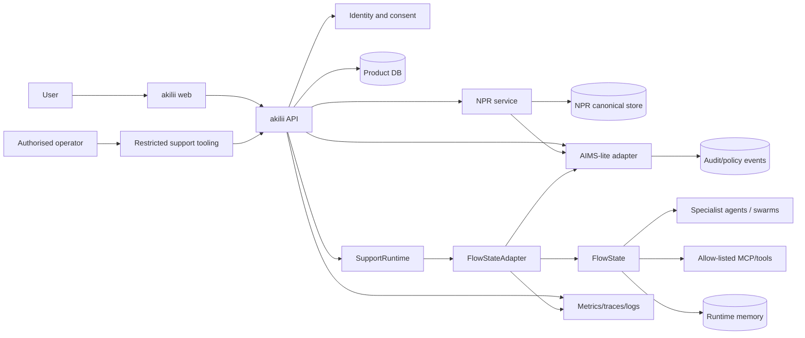
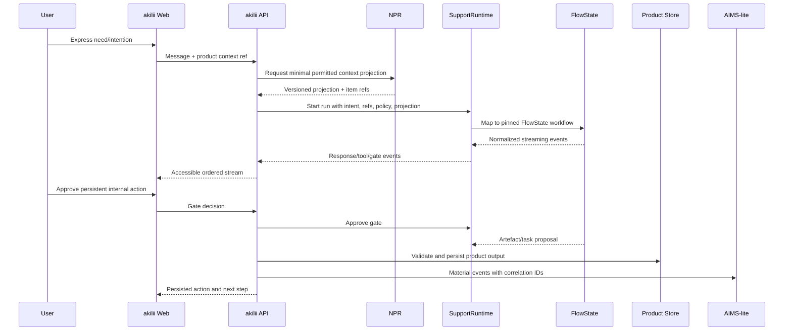
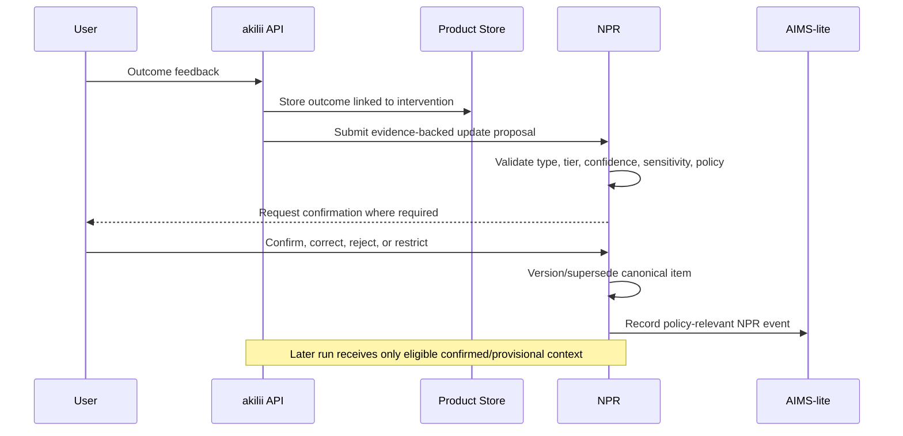

# System Architecture and State Specification

## Scope

This document expands the PRD architecture enough for implementation and review. It is not a commitment to the wider FS:One target architecture.

## Context architecture

## Component responsibilities

| Component | Owns | Must not own |
|---|---|---|
| akilii web | User interaction, local drafts, accessible run controls, view composition | Authorisation decisions, canonical NPR, FlowState sessions |
| akilii API | Authentication context, authorisation, domain orchestration, product contracts | Provider-specific or FlowState-specific logic |
| Product store | Conversations, projects, tasks, artefacts, interventions, outcomes | Runtime scratch state, inferred personal truth |
| NPR service/store | Canonical structured personal context and lifecycle | Full transcripts, runtime chain-of-thought, agent scratchpads |
| SupportRuntime | FullSpektrum orchestration contract | Product UI assumptions, direct NPR persistence |
| FlowStateAdapter | Contract mapping, normalized events, cancellation/gates, correlation | Product-domain truth |
| FlowState | Agent/tool execution, provider abstraction, runtime sessions/memory | Canonical person or project model |
| AIMS-lite | Append-only material policy/audit events | Full product history, raw sensitive payloads, full governance claims |
| Observability | Operational metrics, traces, safe logs, alerting | Alternative analytics profile or hidden NPR |

## Trust boundaries

1. **Browser ↔ application API:** client input and identifiers are untrusted; authenticate and authorise server-side.
2. **Application API ↔ NPR:** only scoped operations; every material access has purpose and subject.
3. **Application API ↔ runtime:** send minimum context projection and product references, not unrestricted records.
4. **FlowState ↔ model providers/tools:** external processing boundary; apply allow-lists, redaction, provider policy, timeout, and gates.
5. **Operational tooling ↔ personal data:** privileged access; least privilege, explicit reason, audit, and time-bounded access.

## Canonical state matrix

| State | Canonical store | Writer | Readers | Retention class | Deletion behaviour |
|---|---|---|---|---|---|
| Identity/account | Auth/application store | Auth service | API | Account | Delete/disable per account policy |
| Consent/control | Product/NPR control store | User via API | API/NPR/policy | Legal/product TBD | Preserve minimal proof where required without content |
| NPR item | NPR store | NPR service only | API via scoped projection | Tier/sensitivity based | Delete canonical and derived indexes |
| Conversation/message | Product store | API | User/API | Product policy TBD | Delete/export per user control |
| Project/task/artefact | Product store | API | User/API/runtime by reference | Product policy TBD | Cascade or detach by documented rule |
| Intervention/outcome | Product store | API | User/API/NPR evaluator | Evidence policy TBD | Preserve links only when allowed |
| Run status/ref | Product store + runtime ref | Adapter/API | UI/API | Operational/product | Purge runtime detail independently |
| Runtime session/memory | FlowState | FlowState | FlowState/adapter | Bounded session policy | Purge on account/session deletion request |
| Audit event | AIMS-lite store | Event adapter | Privileged operator | Security/privacy TBD | Redact/tombstone subject linkage per policy |
| Metric/trace/log | Observability system | Services | Operators | Short operational policy | Remove subject linkage and sensitive payloads |

## Primary sequence: support and action

## Outcome and learning sequence

## Failure-mode contract

| Failure | Required product behaviour | Data guarantee | Operator signal |
|---|---|---|---|
| NPR unavailable | Continue with no/limited personalization and explain only if material | No fabricated context; no silent fallback to runtime memory | Error/latency trace and degraded-mode metric |
| FlowState start fails | Preserve user input; offer retry; do not create action | Idempotency prevents duplicate run | Correlated runtime error |
| Stream disconnects | Reconnect from event ID; show last confirmed state | Ordered events; no duplicated persisted action | Reconnect rate |
| Tool fails | Keep completed safe output; explain failed step; permit scoped retry | Partial results explicitly typed | Tool error by type/version |
| Gate denied/cancelled | Stop scoped action immediately | No product write | Gate outcome event |
| Product persistence fails after runtime output | Show draft/proposal, not “saved”; allow retry | Runtime output does not become canonical | Persistence failure alert |
| AIMS-lite unavailable | Material mutation follows fail-open/closed policy by event class | Queue or block according to policy; never silently discard | Audit pipeline alert |
| Model timeout | Preserve draft and completed tool outputs; allow retry/cancel | No duplicate writes | Provider timeout/cost metric |
| NPR version conflict | Ask API to reload and reapply intentional change | Optimistic concurrency; no last-write-wins | Conflict event |

Whether audit failure blocks each event class must be recorded in the AIMS-lite ADR. NPR mutation, tool approval, deletion, and privileged access should default to fail closed until decided.

## Deployment topology requirements

- Separate local, preview/test, staging, and production-like/pilot configurations.
- Separate data and secrets between environments.
- Pinned application, contract, schema, prompt/workflow, FlowState, and migration versions.
- All services emit correlation IDs and release/build version.
- Backups and restore apply to canonical stores; derived indexes can be rebuilt.
- Provider and tool endpoints are configuration, not hard-coded.

## Architecture acceptance checklist

- [ ] UI has no direct FlowState, database, or provider dependency.
- [ ] Runtime types do not leak into product-domain persistence.
- [ ] NPR projection is minimal, versioned, purpose-scoped, and traceable.
- [ ] Runtime cannot write NPR directly.
- [ ] Product writes happen through authorised domain APIs.
- [ ] Every material run can be correlated across product, runtime, and audit events.
- [ ] Derived indexes identify canonical source and deletion path.
- [ ] Failure injection demonstrates retry/idempotency/partial-success behaviour.
- [ ] Deployed diagram matches the implementation.

